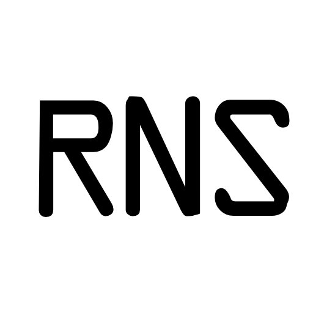

# RNSD Menu Bar

A native macOS menu bar app for the [Reticulum Network Stack](https://reticulum.network/) daemon. Auto-starts `rnsd`, monitors its status, and provides one-click access to `rnstatus`, `rnid`, `rnpath`, and `rnprobe` — plus an auto-populating Nodebook of contacts discovered from network announces.



## Features

- **Auto-starts and supervises rnsd** — starts on launch, stops on quit
- **Live status indicator** in the menu bar
- **GUI wrappers** for rnstatus, rnid, rnpath, and rnprobe
- **Nodebook** — automatically discovers and stores LXMF / NomadNet nodes from announces, grouped by type
- **Async commands** — `rnpath lookup` and `rnprobe` run in background threads so the menu bar never freezes
- **Self-contained `.app`** — bundles RNS and all Python dependencies; no separate install needed

## Requirements

- macOS 11 or newer
- [uv](https://github.com/astral-sh/uv) for environment management

## Run from source

```bash
git clone https://github.com/YOURNAME/rnsd-menubar.git
cd rnsd-menubar
uv sync
uv run rnsd_menubar.py
```

## Build a standalone .app

```bash
uv sync --group build
uv run pyinstaller RNSD.spec
cp -r dist/RNSD.app /Applications/
```

Then add it to **System Settings → General → Login Items** if you want it to launch automatically.

## Project layout

```
rnsd_menubar.py     # main script
RNSD.spec           # PyInstaller spec for building the .app
pyproject.toml      # dependencies (managed by uv)
rns_icon.png        # dialog icon
rns_menu_icon.png   # menu bar icon
rns_icon.icns       # app bundle icon
```

## License

MIT
