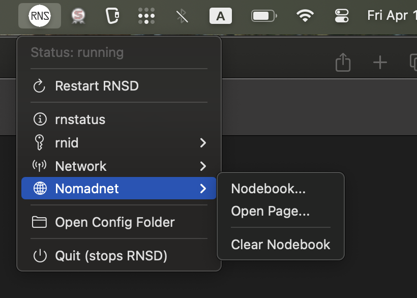
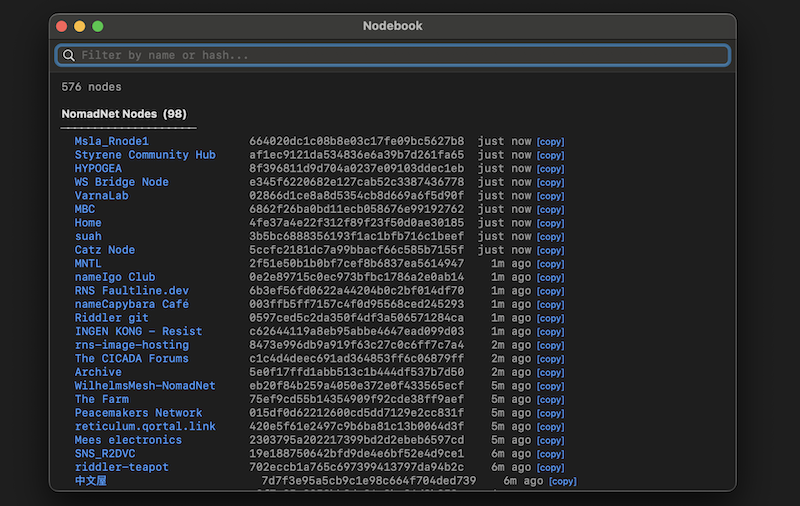
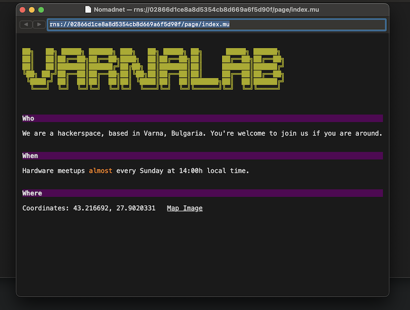
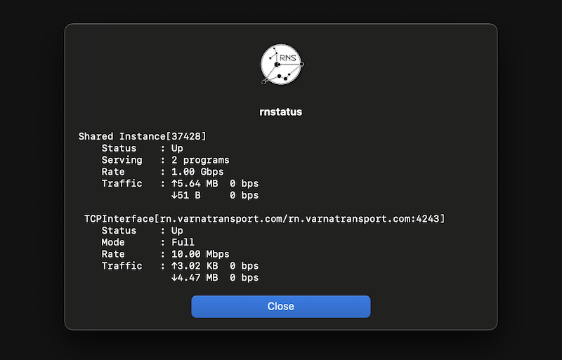

# RNSD Menu Bar

A native macOS menu bar app for the [Reticulum Network Stack](https://reticulum.network/) daemon. Auto-starts `rnsd`, monitors its status, and provides one-click access to `rnstatus`, `rnid`, `rnpath`, and `rnprobe` — plus an auto-populating Nodebook of contacts discovered from network announces.









## Features

- **Auto-starts and supervises rnsd** — starts on launch, stops on quit, cleans up orphaned processes
- **Live status indicator** in the menu bar
- **NomadNet page browser** — native WKWebView-based browser with back/forward navigation, micron markup rendering, and `nomadnetwork://` link support (both absolute and same-node relative links)
- **File downloads** — `/file/` paths trigger a native Save dialog
- **Nodebook** — searchable window with live filtering, auto-populated from network announces, sorted by announcement time with "time ago" labels. NomadNet node names are clickable to browse, with one-click link copying
- **Network tools** — unified Network menu with path lookup, probe (auto-detects aspect from Nodebook), and a searchable path table window grouped by hop count with name resolution
- **Searchable contact picker** — all destination pickers (probe, lookup) use a live-filtered list instead of dropdowns
- **GUI wrappers** for rnstatus and rnid
- **Copy/paste support** — Cmd+C/V/X/A work in all windows
- **Self-contained `.app`** — bundles RNS and all Python dependencies; no separate install needed

## Requirements

- macOS 11 or newer
- [uv](https://github.com/astral-sh/uv) for environment management

## Run from source

```bash
git clone https://github.com/YOURNAME/rnsd-menubar.git
cd rnsd-menubar
uv sync
uv run rnsd_menubar.py
```

## Build a standalone .app

```bash
uv sync --group build
uv run pyinstaller RNSD.spec
cp -r dist/RNSD.app /Applications/
```

Then add it to **System Settings → General → Login Items** if you want it to launch automatically.

## Project layout

```
rnsd_menubar.py     # main script
RNSD.spec           # PyInstaller spec for building the .app
pyproject.toml      # dependencies (managed by uv)
rns_icon.png        # dialog icon
rns_menu_icon.png   # menu bar icon
rns_icon.icns       # app bundle icon
```

## License

MIT
